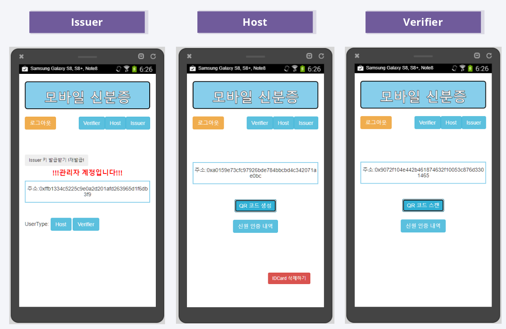
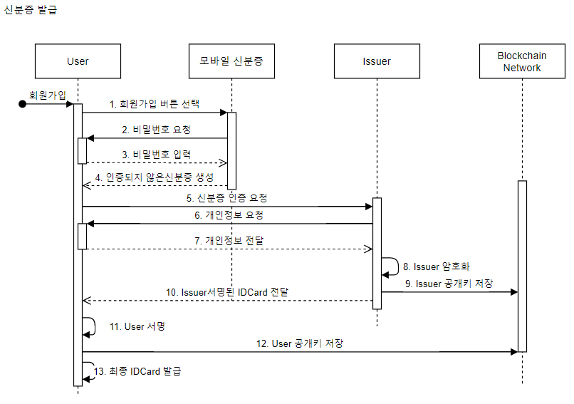
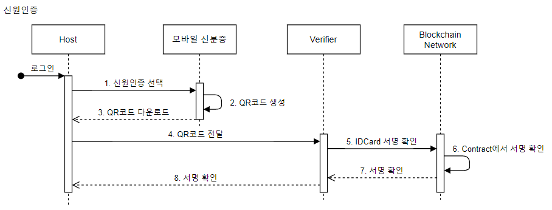
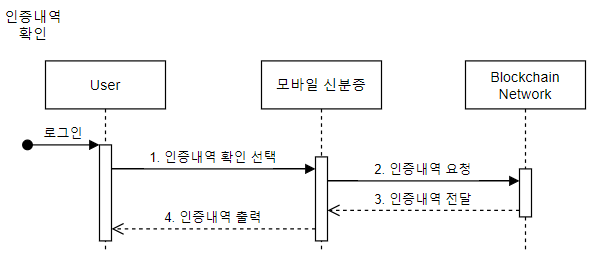
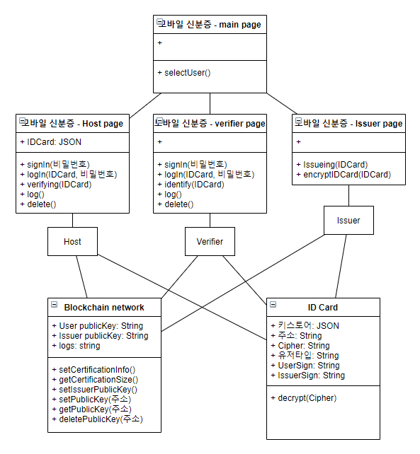
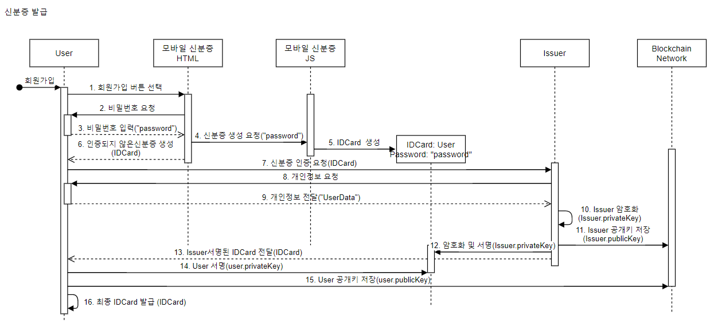
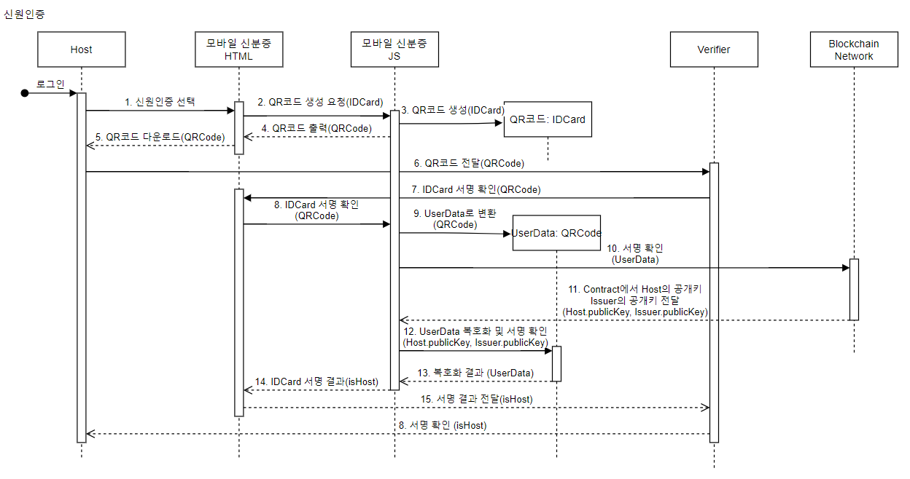
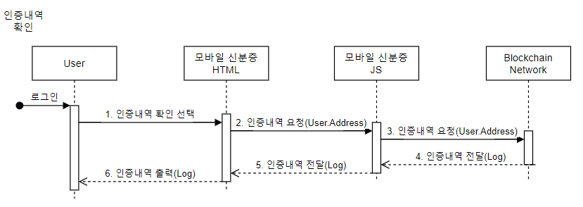

# 실행방법
현재 리포 받은 후 
> npm install  
> truffle-config.js에서 PrivateKey 변경  
> npm run dev //실행
> npm run build //웹팩 번들링 (/dist 에 index.html,index.js 로 저장)

# 주요 버전
- node.js: 10.15.3
- npm: 6.4.1
- caver-js: v1.5.2-rc.1
- truffle: 4.1.15
- solidity: 0.4.25
- using webpack

# 진행과정
- 8/2: 클레이튼으로 제작환경 옮김
- ~ 8/6: 클레이튼 실습 진행(Addition-Game), 실습 기반으로 제작 시작
- ~ 8/9: 로그인 세션, 호스트 데이터 컨트랙트 구현
- 8/14: crypto session 구현 시작 
- 8/18: Repository 옮김
- 8/20: Issuer - host 시나리오 완성, 개인키/공개키 일부 완성, rsa.js 일부수정
- 8/24: Issuer가 host가 해야할 서명, 암호화 등을 대신 진행함, 전달 이후 데이터 파기하는 시나리오 제시.
        (Isser가 Host의 키쌍을 만들어주고 블록체인에 공개키를 올리고 서명또한 진행한 뒤 PrivateKey 전달, 이후에 모두 파기하는 식)
        필요없는 코드 지우고 파일 저장 조금 수정했음.(파일형식, JSON 저장시 들여쓰기), RSA에서 getkey시 새로생성하게 수정
- 8/26: 현재 진행상황 확인 / 시나리오 전면 재검토 후 추가 및 수정 진행
- 8/27: 시나리오 개편 - 각종 이슈 확인 및 진행상황 업데이트
- 8/30: Host - Issuer간 통신 업데이트 ( User에서 키스토어 발급 > Issuer암호화 진행 > User가 직접 개인키로 서명)
- 09/05 : Verifier  Host QR코드 스캔기능 추가 
- 09/21 : Verifier  Host QR코드 카메라 스캔 기능 추가 및 전체시나리오 모바일 환경 테스트

# TODO
- 미비된 기능 확인 후 정리
- UI/UX 다듬기
- CL Algorithm 확인 후 구현

###시나리오

# User
- Issuer
    > 계정 인증을 진행하는 User  
        각 계정이 올바른 정보를 입력하였는지 확인한 후 서명 및 암호화 진행 
- Host
    > 자신의 신원 정보를 Verifier에게 인증하고자 하는 User  
        자신의 정보를 Issuer에게 전달(오프라인)하여 암호화된 파일을 얻고, 이를 사용하여 Verifier에게 자신의 신원을 인증받을 수 있다.  
- Verifier
    > 자신의 서비스를 이용하고자 하는 Host의 정보를 확인하고자 하는 User  
        Host가 암호화된 자신의 정보를 넘겨주면 Blockchain에서 암호를 받아 host의 신원을 확인할 수 있다.
             
             
# Senario #0 - 공통: Login session
1. 각각의 User는 각 login 버튼을 클릭하여 로그인/회원가입 할 수 있다.
2. 각 로그인 세션에서 IDCard / 키스토어를 통해 로그인 할 수 있다.
     
# Senario #1 - Issuer (DONE)
- 각 신분증에는 암호화되지 않은 User type 기입되어 있다.
* User Type 암호화 이슈
    - user type을 암호화 하지 않는 경우 임의로 변경할 수 있음
    -> 서명/확인으로 구현 
1. User의 키스토어를 입력받는다. 
2. User의 정보를 오프라인으로 전달받는다.
3. User의 정보를 입력한다.
4. Issuer Private Key를 입력하여 User의 정보를 암호화한다.
5. Issuer Public Key를 Blockchain에 저장한다.
6. 이중으로 암호화된 User의 정보(신분증)와 User의 PirvateKey를 User에게 전달한다.
    > 유저의 IDCard = (UserType + Data + Keystore) 로 한번에 신분증으로 발급, 유저는 IDCard로 로그인, 신분확인 모두 가능하다.
7. User에게 전달한 이후에는 모든 User관련 데이터 (신원정보, keystore, 암호화된 파일, User의 키쌍) 을 파기한다.

# Senario #2 - Host
1. 신분증 등록하기 (최초 로그인시 사용)
    > Host는 최초 로그인 시 자신의 신분증을 계정에 등록한다.
    1. '신분증 등록하기' 버튼 선택
    2. Issuer에게 받은 신분증 선택
    3. 최초 로그인의 경우(사용자 서명이 없는 경우) host의 개인키를 통해 서명을 추가하게 됨
    
- 현재버전(버전논의필요): ID Card를 Issuer로부터 넘겨받은 후 바로 사용하게 됨  
    <토의 필요> PrivateKey와 이중서명된 Data파일에 대한 간수는 본인이 책임져야한다.
    (AES암호화 등 추가 암호화가 필요할듯하고 저장소에 대한 최소 보안 확보 필요.)

* Host가 사용하게 될 Klay 이슈 
    1. wallet.klaytn.com에서 faucet으로 전달
    2. issuer가 대신 부담하게 함

* 개인키 이슈 
개인키를 Issuer가 만을 것인가 / host가 만들것인가

 
2. 인증 내역 확인하기
    1. '인증내역 확인하기' 버튼 선택
    2. 자신의 신분증을 확인한 내역 확인
        > (미정) 사용자의 공개키 트랜잭션 활용 / 받는 transaction, 확인완료 transaction

3. 신분증 삭제하기
    1. '신분증 삭제하기' 버튼 선태
    2. 최종 확인 후 신분증 제거  
        > (미정) Host 서명 제거? Issuer 서명 제거? 방법필요
        >> 그냥 발급받은 신분증 파일 파기하면 끝.
        >>> 블록체인에 남는건 공개키 뿐인데 이거는 삭제해도 안해도 신원정보 유출에 아무 관련 없음.

# Senario #3 - Verifier
1. Host 신원 확인하기
    1. '신원 확인하기' 버튼 선택
    2. Host에게 신분증을 전달받음
        > 신분증 전달받을 방법 필요 (qrcode plugin 있음) https://web-inf.tistory.com/15
        >> 신분증을 전달받는 방법 잘 생각해야할듯.
        >>> 공개키는 블록체인에 공개되어있기 때문에 신분증이 중간에 탈취당하면 위험.
    3. Blockchain에 있는 Host의 공개키를 통해 Host의 소유권을 확인
    4. Issuer의 공개키를 통해 Host 신분증을 복호화하여 내용을 얻음과 동시에 신원정보에 대해 검증받음.
    5. Host의 각종 신원정보 확인가능 및 소유권, 실존정보검증 모두 완료.
** Verifier를 위한 ID Card 논의중
** 거래내역 이슈
- 거래내역을 확인할 수 있는 방법 필요
> 공개키로 암호화 >> 개인키로 복호화 하여 거래 내역 확인 (privacy 이슈 해결)  
> host >> key=>addr, value => 암호화(시간+업체정보+제공한 신원정보내역)  
> verifier >> key=> addr, value => 암호화(시간+이름+요청한 신원정보)  
> 위와 같은 방법으로 transaction 실행

# 신분증 Form (미정)
~~~
신분증 Form:
{
UserType: Issuer | Host | Verifier,
userData: 암호화된 userData,
IssuerSign: ,
UserSign:
 // 이후 추가 가능 
}
~~~

# 각종 설계문서

